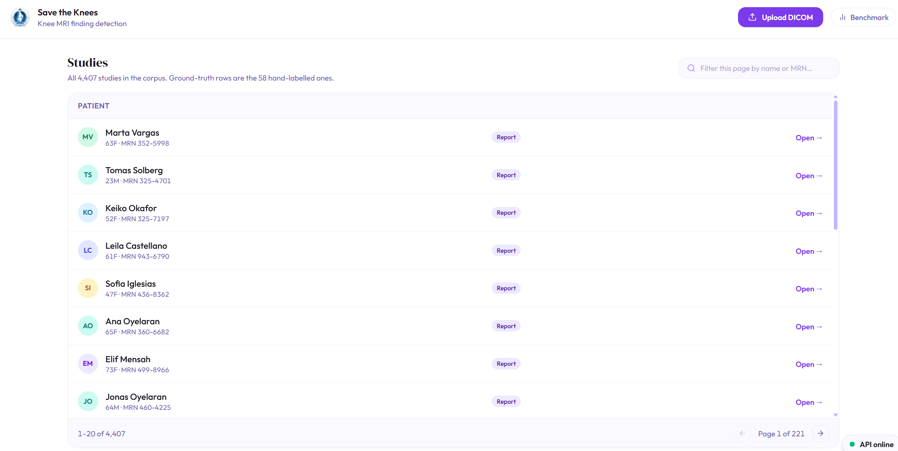
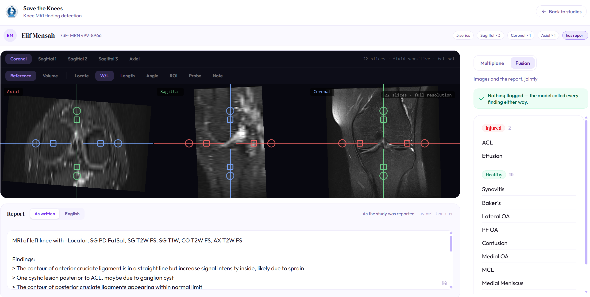
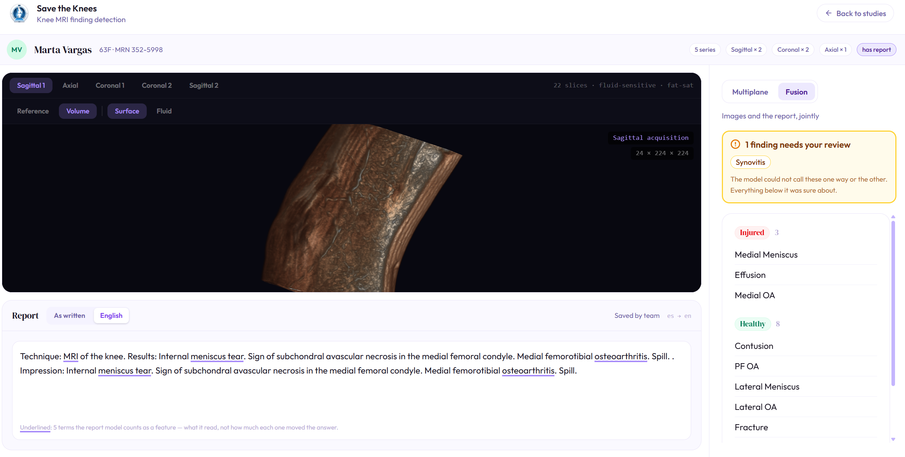
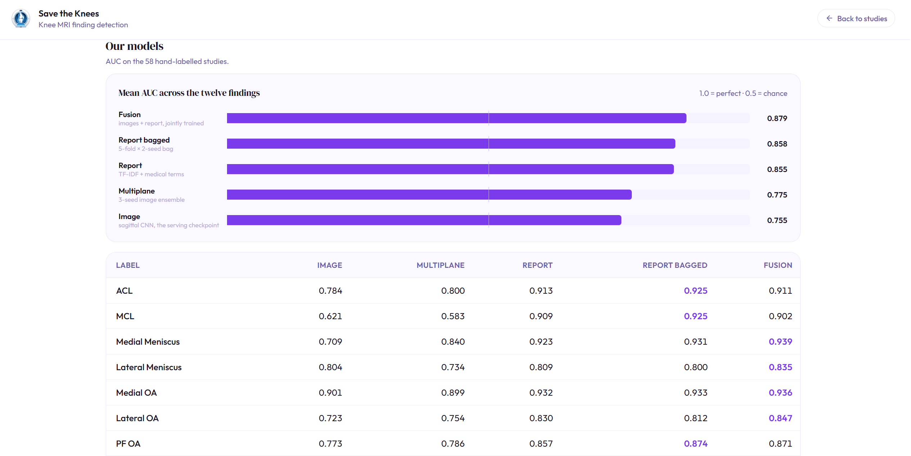

# SaveTheKnees — Knee MRI Injury Detection

A machine learning system that **flags potential mismatches** between knee MRI scan
findings and the radiologist's report — a quality-assurance safety net for radiology
workflows, not a diagnostic tool.



## What it does

When a radiologist reads a knee MRI, they write a report describing what they see.
SaveTheKnees analyses the images independently and flags cases where the model's
findings don't line up with the written report — helping catch missed injuries before
the report is finalised.

The system detects 12 common knee conditions:

- **Ligament injuries** — ACL, MCL
- **Meniscus tears** — medial, lateral
- **Arthritis** — medial OA, lateral OA, patellofemoral OA
- **Other** — effusion, synovitis, Baker's cyst, contusion, fracture

## How it works

1. **Input** — multi-view knee MRI study (DICOM) plus the radiologist's report text.
2. **Processing** — a shared 3D CNN backbone reads all three viewing angles
   (coronal, sagittal, axial), and attention pooling weighs slices by how informative
   they are before the views are fused.
3. **Output** — a confidence score per condition and a comparison against the parsed report.

## Features

- **Multi-view analysis** — three viewing angles processed in parallel
- **Multi-language reports** — report text handled across 9 languages
- **Reading-room demo UI** — React frontend for exploring predictions
- **QA framing** — explicitly a safety net, never a diagnosis

## Screenshots

The reading room: three planes cross-referenced, the report beside them, and the
model's per-finding calls on the right.



Volume rendering, the report translated to English with the terms the report model
actually keyed on underlined, and an explicit "needs your review" flag when the model
can't call a finding either way.



## Results

AUC on the 58 hand-labelled gold studies. Fusion — images and report trained jointly —
leads at 0.879 mean AUC across the twelve findings.




## Project structure

```
SaveTheKnees/
├── data/                  # Label CSVs, gold studies, tensor cache
├── functions/             # DICOM I/O, GCS blobs, tensor building, translation
├── models/                # Architectures, training, evaluation
│   ├── architectures.py   # Multi-view ResNet50 + attention pooling
│   ├── train.py           # Main training entry point
│   └── evaluate_labels.py # Referee: scores checkpoints on the 58 gold studies
├── serving/my_api.py      # FastAPI prediction service (Cloud Run)
├── Frontend/              # Vite + React reading-room UI
├── notebooks/             # Per-author experimentation
└── Docs/                  # Project introduction and tech constraints
```

## Dataset

Trained on ~4,000 knee MRI studies from the RSNA Knee Abnormality Detection
competition (Kaggle) — roughly 820,000 DICOM images across labeled and unlabeled
studies. Training uses semi-supervised pseudo-labeling on the unlabeled subset.

## Installation

Clone the repository, then create the virtual env:

```
pyenv virtualenv 3.10.6 save-the-knees-env

pyenv local save-the-knees-env

pip install -r requirements.txt
```

## Train on your own machine (Mac / Windows / Linux)

The training data lives as preprocessed blobs in Google Cloud Storage — nobody
needs the 600 GB raw DICOM. One command builds the env for YOUR platform
(NVIDIA CUDA on Linux/WSL2, Apple Metal on macOS) and pulls the ~16 GB of blobs:

```
gcloud auth login          # once, with your account on the savetheknees project
bash setup_training.sh
```

It prints the canonical training commands when done. Windows + NVIDIA: run it
inside WSL2 (native Windows TensorFlow is CPU-only). Trained checkpoints are
pushed back to `gs://knees-models` under your own name — promotion happens only
via the referee on the 58 gold studies (`models/evaluate_labels.py`).

## Run the demo UI

```
cd Frontend
npm install
npm run dev
```

## Team

David Kurland · Kevin Ramirez · Nikolas Contessotto · Andres Garcia

*Built as the final capstone project for the Le Wagon Data Science & AI bootcamp.*

## Disclaimer

⚠️ **This is a research and educational project, not a medical device.** It exists to
flag potential inconsistencies for human review. It must never be used for diagnosis
or clinical decision-making without expert radiologist validation.

## License

Shared for educational purposes.
